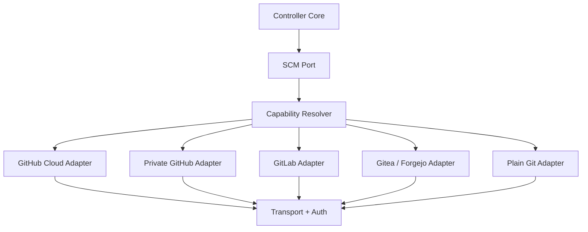

# SCM 可迁移与私有 Git 设计

## 1. 目的

本设计保证 Project Agent Controller 不与 GitHub.com 绑定。后续迁移到私有 GitHub、GitLab、Gitea/Forgejo 或普通 Git 服务时，核心任务引擎、日志监听和报告生成无需重写。

迁移范围分为两类：

1. **Git 数据迁移**：提交、分支、标签、LFS 对象；
2. **协作数据迁移**：Issue、PR/MR、评论、检查状态、附件、发布和自动化配置。

Git 数据可较稳定地镜像迁移；协作数据因平台模型不同，需要通过能力映射、导出归档或保留只读源站处理。

## 2. 核心原则

- 核心领域对象不使用 `PullRequest`、`GitHubCheckRun` 等平台专有类型；
- provider 在启动时声明 capabilities；
- 不支持的能力必须显式降级，不得静默伪造成功；
- provider 配置、项目配置和 secrets 分离；
- 远端仓库标识使用内部稳定 ID，不把 URL 当主键；
- 每次外部写操作都使用幂等键；
- 支持一个项目配置多个 remote，便于迁移期双读或镜像；
- 切换 provider 不改变本地事件历史和 task ID。

## 3. 分层模型



### 3.1 SCM Port

建议领域接口：

```text
RepositoryReader
  get_repository()
  get_default_branch()
  get_ref()
  get_commit()
  list_checks()

RepositoryWriter
  create_or_update_file()
  create_branch()
  push_ref()

CollaborationReader
  get_work_item()
  get_change_request()
  list_comments()

CollaborationWriter
  create_work_item()
  create_change_request()
  upsert_comment()
  publish_status()

ArtifactPublisher
  upload_artifact()
  create_artifact_link()
```

核心调用先请求能力，再调用接口：

```text
if provider.supports("change_request.comment.upsert"):
    publish_comment()
else:
    write_local_report_and_record_degradation()
```

## 4. Provider 能力模型

能力使用稳定字符串声明，例如：

```text
repository.read
repository.file.write
repository.branch.create
repository.ref.update
work_item.read
work_item.write
change_request.read
change_request.write
change_request.comment.write
status.publish
artifact.upload
webhook.receive
```

每个 provider 返回：

- provider 类型和 adapter 版本；
- 服务端版本信息（可读取时）；
- 支持能力；
- 限流信息；
- 最大文件大小等约束；
- 当前认证主体和权限范围；
- 健康状态。

能力不足时，任务进入 `DEGRADED` 或 `BLOCKED`，而不是报告成功。

## 5. 配置模型

### 5.1 Provider 配置

```yaml
config_version: 1

scm_providers:
  github_cloud:
    kind: github
    api_base_url: https://api.github.com
    web_base_url: https://github.com
    credential_ref: env://PAC_GITHUB_TOKEN

  private_github:
    kind: github
    api_base_url: https://git.example.internal/api/v3
    web_base_url: https://git.example.internal
    credential_ref: keychain://pac/private-github
    tls:
      ca_bundle_ref: file-secret://private-ca.pem

  home_gitea:
    kind: gitea
    api_base_url: https://git.home.internal/api/v1
    web_base_url: https://git.home.internal
    credential_ref: env://PAC_GITEA_TOKEN
```

仓库可版本化配置只保存 `credential_ref`，不保存凭据值。包含私有域名、证书位置和本机信息的实际 provider 配置应存放于控制器私有配置目录。

### 5.2 项目绑定

```yaml
projects:
  kanyu:
    repository_id: repo_kanyu
    scm:
      primary:
        provider: private_github
        owner: research
        name: kanyu-spatial-engine
      mirrors:
        - provider: github_cloud
          owner: lpearf-pixel
          name: kanyu-spatial-engine
          mode: reports-only
```

`repository_id` 是控制器内部稳定标识。provider、owner、name 或 URL 变化不影响本地任务和历史事件。

## 6. Provider 类型

### 6.1 GitHub Cloud / 私有 GitHub

两者共享大部分领域映射，但必须允许不同：

- API 和 Web base URL；
- 认证方式；
- TLS 和代理；
- 服务端支持能力；
- 速率限制；
- Actions、Packages、LFS 等可选服务。

不能因为 `kind: github` 就假设云端全部能力存在。实际能力通过探测和配置共同确定。

### 6.2 GitLab

映射原则：

- Issue 映射为 work item；
- Pull Request 映射为 change request；
- GitLab Merge Request 由 adapter 转换；
- pipeline/status 归一为验证状态；
- GitLab 专有审批规则保存在 provider extension 中，不污染核心模型。

### 6.3 Gitea / Forgejo

适合家庭或小型内网部署。支持的协作能力以运行实例探测结果为准。缺失检查状态或附件能力时，可退化为报告文件、Issue 评论或对象存储链接。

### 6.4 Plain Git

只要求可访问 Git remote，支持：

- fetch/push；
- branch/tag；
- 报告文件提交。

不支持 Issue、PR、评论和状态检查。控制器仍可完整运行，本地 API 成为主要协作入口。

## 7. Secrets 与网络

### 7.1 凭据来源

支持顺序：

1. 系统钥匙串或 secret manager；
2. 只在进程环境中存在的环境变量；
3. Docker/Kubernetes secret 文件；
4. 短期动态凭据。

禁止：

- 把 token 写进 YAML；
- 把 token 输出到日志；
- 在报告中显示认证 header；
- 用同一高权限 token 管理所有项目。

### 7.2 权限最小化

按 provider 和项目拆分凭据。Observer 模式只需要读权限；报告同步仅增加目标仓库有限写权限；创建 PR 或 Issue 使用独立授权；合并和管理权限不授予常驻控制器。

### 7.3 私有网络

provider transport 支持：

- 自定义 DNS；
- HTTP/SOCKS 代理；
- 内部 CA；
- mTLS 扩展；
- 连接超时和重试；
- 网络不可用时离线队列。

网络恢复后按幂等键补偿，不重复创建评论或提交。

## 8. 迁移流程

### 阶段 0：盘点

生成迁移清单：

- 仓库大小、分支、标签；
- Git LFS；
- submodule；
- Issue、PR、评论和附件数量；
- CI、webhook、packages、releases；
- deploy key、机器人账号和 secret；
- 外部链接和回调。

### 阶段 1：建立目标 provider

- 配置私有 Git 服务和 TLS；
- 创建最小权限凭据；
- 注册新 provider；
- 执行 capability probe；
- 创建空目标仓库；
- 保持源仓库不变。

### 阶段 2：Git 镜像验证

- 镜像提交、分支和标签；
- 单独迁移 LFS；
- 校验 refs 数量和 commit 可达性；
- 对关键 tag 和默认分支比较 SHA；
- 验证 clone、fetch 和 push。

### 阶段 3：协作数据处理

按优先级选择：

1. 平台原生导入工具；
2. API 迁移并保存 source ID 映射；
3. 生成只读归档；
4. 源平台保留只读并在目标仓库链接。

控制器保存：

```text
source_provider
source_object_type
source_object_id
target_provider
target_object_type
target_object_id
migration_batch_id
checksum
```

### 阶段 4：双运行

推荐模式：

- 新 provider 为读取候选；
- 源 provider 继续作为主写；
- 报告可双写，但业务代码只单写；
- 比较提交、状态、评论幂等行为；
- 禁止双向代码同步，避免分叉。

### 阶段 5：切换

- 暂停新的 SCM 写任务；
- 完成最后一次镜像和差异检查；
- 把项目 `primary` 改为目标 provider；
- 更新 clone URL、CI、webhook 和凭据；
- 运行验收测试；
- 源仓库设为只读或 reports-only。

### 阶段 6：观察和退役

保留回退窗口。在确认新 provider 稳定后，再撤销旧 token、webhook 和自动化。源仓库是否删除由用户单独决定，控制器不得自动删除。

## 9. 回滚方案

切换失败时：

1. 全局进入 SCM write drain；
2. 停止目标 provider 新写入；
3. 将 `primary` 指回源 provider；
4. 对切换窗口内目标提交建立清单；
5. 人工确认后单向镜像回源；
6. 恢复源 provider 写入；
7. 保留失败迁移事件和映射表。

任何回滚都不得强制覆盖存在未知提交的分支。

## 10. 迁移验收标准

- 默认分支、受保护分支和 tags 均可读取；
- 关键 refs 的 commit SHA 与预期一致；
- LFS 文件可完整检出；
- Controller 能读取 commit 和验证状态；
- Controller 能在授权范围内发布一次幂等报告；
- 重复执行同步不会产生重复评论或重复 commit；
- 断网后本地观察继续运行，恢复后补同步；
- 切换 provider 只修改配置，不修改 Task Engine 和 Reporter；
- 源 provider 可在回退窗口内恢复为 primary；
- secrets 扫描不发现迁移凭据。

## 11. 推荐策略

近期使用 GitHub.com 作为协作后端，但从第一行实现开始使用 SCM Port。私有化优先考虑“新 provider 注册 + 单向镜像 + 验证 + 切换”，而不是在代码中写死某一平台后再重构。

对于包含个人数据、税务、关系数据和私有知识库的项目，建议只把脱敏报告同步到公共托管平台；原始证据、数据库、日志和项目源码可迁移至私有 Git 服务或完全内网环境。
