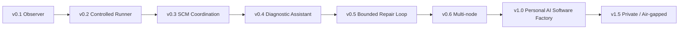

# Project Agent Controller 版本演进路线图

## 1. 路线图原则

演进顺序遵循：

1. 先建立可信观察和安全状态检查点；
2. 再允许受控执行；
3. 再接入完整的外部协作能力；
4. 再增加 AI 分析；
5. 最后才允许有边界的自动修复。

任何版本都不得以牺牲停止、审计、证据和回滚能力换取自动化速度。

## 2. 版本总览

## 3. v0.1 Observer：可信观察基线

### 目标

替代人工复制日志，建立多项目统一状态和证据系统。控制器只观察已由用户或现有工具启动的任务，不主动运行项目命令。

### 能力

- 项目注册；
- 文件、进程、Docker、Git watcher；
- 外部任务登记与 ownership；
- SQLite WAL 事件库；
- 增量日志游标；
- 项目状态 API 与 CLI；
- Markdown/JSON 报告；
- 控制器内部任务停止、项目暂停、全局 drain、紧急停止；
- 对 `owned` 外部进程的受控停止；
- 重启恢复和 orphan 识别；
- secrets 与本机路径脱敏；
- 可选 reports-only 状态检查点，同步到专用私有状态仓库或隔离状态分支；
- 本地运行，不开放公网。

### 禁止

- 运行项目 test/lint/build 等命令；
- 自动改代码；
- 自动提交或推送业务工作区变更；
- 自动创建 PR/Issue 或评论；
- 自动合并、强推或删除；
- 任意 shell；
- 远程停止命令。

### 退出门槛

- 三类项目稳定运行；
- 长任务持续观察超过一小时；
- 断网、重启、日志轮转测试通过；
- stop/recovery 故障注入通过；
- reports-only 同步幂等且不触碰业务分支；
- 无敏感信息进入报告。

### v0.1D 宿主常驻门禁

- macOS LaunchAgent 与 Linux systemd user service 只生成定义，不在测试中安装；
- 私有环境文件权限、大小和键白名单 fail-closed；
- 社区甄选生产 Git、CI、API、edge 与 PostgreSQL Source 使用精确声明；
- Ubuntu 公共 Runner 完成真实 Docker GET-only 预检；
- Emergency Stop 解除后必须经过 `RECOVERING` 和显式完成恢复。

## 4. v0.2 Controlled Runner：受控执行

当前状态：Draft 实现已覆盖固定模板、Git HEAD 隔离副本、幂等记录、重试、超时进程组清理、输出上限、控制状态门与项目熔断；任务队列、优先级、依赖和定时调度仍后置。

### 目标

由控制器执行白名单验证命令，而不是只观察外部执行。

### 新增能力

- 命令模板；
- 参数和环境变量白名单；
- 任务队列、优先级和依赖；
- 每项目并发限制；
- 启动、空闲和最长运行超时；
- CPU、内存、磁盘和日志大小限制；
- 幂等键与 attempt；
- 定时验证任务；
- 失败熔断和半开探测。

### 仍然禁止

- 修改业务文件；
- 自动提交和推送业务变更；
- 数据库破坏性操作；
- 生产部署。

### 退出门槛

- 命令注入测试通过；
- 不同语言项目的 test/lint/verify 可配置执行；
- 任务停止不会遗留子进程；
- 重复请求不会重复执行同一幂等任务。

## 5. v0.3 SCM Coordination：托管平台协作

### 目标

在 v0.1 的最小 reports-only 检查点之上，加入可迁移的完整 SCM 协作层。

### 新增能力

- GitHub Cloud adapter；
- 私有 GitHub adapter；
- Gitea/Forgejo adapter；
- GitLab adapter；
- provider capability probe；
- 幂等 PR/Issue/MR 评论；
- commit/check/branch 读取；
- 验证状态发布；
- 离线同步队列；
- reports-only mirror；
- provider 切换验收工具；
- 协作对象 source/target ID 映射。

### 安全边界

- 默认只读 SCM；
- 写入必须按项目授权；
- 不允许自动 merge、force push 或删除；
- 工作区存在未知变化时禁止提交报告到业务分支；
- 公共仓库不允许接收私有日志、绝对路径和个人数据。

### 退出门槛

- GitHub 与 Gitea mock provider 契约测试通过；
- provider 不可用不影响本地观察；
- 重试不会重复评论；
- 配置切换 provider 不修改核心任务代码；
- GitHub.com 到私有 Git provider 的演练迁移通过。

## 6. v0.4 Diagnostic Assistant：AI 诊断助手

### 目标

AI 根据结构化证据解释失败，但不直接改代码。

### 新增能力

- 日志分段和错误聚类；
- 失败根因候选；
- 最近成功运行对比；
- commit/diff/环境变化关联；
- 诊断置信度和证据引用；
- 多模型 provider；
- 本地模型和云模型可切换；
- 诊断成本、token 和隐私策略。

### 输出约束

诊断必须区分：

- 已证实事实；
- 高概率推断；
- 待验证假设；
- 推荐下一条只读或验证命令。

AI 不得仅凭摘要宣布任务成功。

### 退出门槛

- 每个结论可链接到证据；
- 可在无模型时退化为规则报告；
- 敏感项目可强制只用本地模型；
- 诊断失败不改变原始 task 状态。

## 7. v0.5 Bounded Repair Loop：有边界自动修复

### 目标

对低风险、明确范围的问题建立自动修复闭环。

### 新增能力

- 隔离 worktree 或临时 clone；
- 任务级预算和修改范围；
- 测试先行和验证门禁；
- 自动生成 patch；
- Reviewer Agent；
- secrets、安全和许可证扫描；
- 只创建 draft PR；
- 最大重试次数和停机条件；
- 失败后保留完整 evidence bundle。

### 允许的首批场景

- 文档链接修复；
- 格式化或 lint 确定性修复；
- 明确测试覆盖下的小型回归；
- 生成或更新状态报告。

### 禁止场景

- 支付、账户、权限、安全策略；
- 数据库不可逆迁移；
- 生产部署；
- 删除大量文件；
- 无测试约束的大范围重构；
- 自动合并。

### 退出门槛

- 所有代码修改发生在隔离工作区；
- 无通过验证不得推送；
- 只生成 draft PR；
- 预算耗尽、连续失败或范围漂移会自动停止。

## 8. v0.6 Multi-node：多机器节点池

### 目标

把 MacBook、远程 Mac、Linux 服务器或 GPU 机器纳入统一调度。

### 新增能力

- Controller 与 Worker 分离；
- 节点注册和心跳；
- 标签、能力和资源发现；
- 任务租约与抢占；
- 节点离线恢复；
- 证据分片上传；
- 远程执行双向认证；
- 节点级 emergency stop；
- 工作区缓存和清理策略。

### 约束

- 节点不持有全局高权限凭据；
- 任务按最小权限下发短期凭据；
- 控制平面故障不触发 worker 自动重跑；
- 网络分区时以安全停止或只读观察为默认。

## 9. v1.0 Personal AI Software Factory

### 目标

形成可长期维护的个人 AI 研发控制平面。

### 稳定能力

- 多项目统一任务台账；
- Observer、Runner、Diagnostic、Repair 多模式；
- GitHub/私有 Git/GitLab/Gitea 可替换；
- 多机器调度；
- Planner、Developer、Tester、Reviewer 的受控协作；
- 项目记忆、架构决策和失败经验可版本化；
- 统一策略、审计、成本和风险管理；
- Web 控制台；
- 备份、恢复、升级和迁移工具。

### v1.0 不承诺

- 无监督生产部署；
- 无门禁自动合并；
- 对所有项目通用的自动修复成功率；
- 用 AI 替代项目负责人作高风险决策。

## 10. v1.5 Private / Air-gapped

### 目标

支持完全私有或隔离网络运行。

### 新增能力

- 私有 Git 服务；
- 私有对象存储；
- 私有模型网关或本地模型；
- 离线依赖镜像；
- 内部 PKI；
- 软件包与模型制品签名；
- 可导出的审计包；
- 无公网依赖的更新流程；
- 跨隔离区的人工审批数据交换。

## 11. 跨版本持续要求

每个版本都必须维持：

- 配置版本化；
- 数据库 schema 迁移与回滚策略；
- 事件 schema 向后兼容；
- provider 契约测试；
- stop/recovery 回归测试；
- secrets 扫描；
- 备份恢复演练；
- 升级前 preflight；
- 升级后 smoke test；
- 明确的弃用周期。

## 12. 推荐开发顺序

第一批只推进 v0.1。v0.1 可提供专用私有状态目标的 reports-only 检查点，但不能运行项目命令或触碰业务分支。v0.1 稳定后再引入受控执行；PR/Issue 协作、AI 诊断和自动修复不得提前穿透版本门槛。

这一路线的核心不是尽快做成“自动写代码机器人”，而是先把项目真实状态、执行证据和停止能力做成可靠基础设施。
