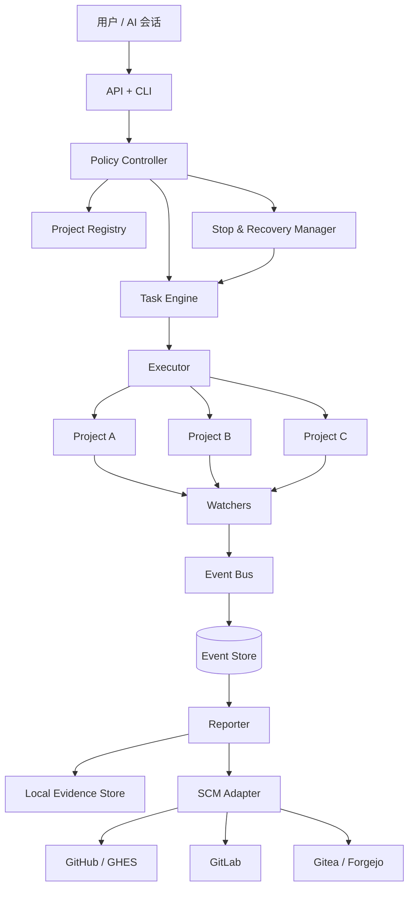

# Project Agent Controller 总体设计 v1.0

- 日期：2026-07-22
- 状态：已形成设计基线，等待书面评审
- 阶段：设计优先，尚未进入功能实现
- 部署取向：本地优先、混合式、可迁移至私有 Git

## 1. 背景与问题

多个长期项目同时运行测试、容器、批量导入和 CI 验证时，用户需要反复复制终端输出给 AI 会话分析。该流程存在以下问题：

- 日志搬运频繁，长任务无法持续观察；
- 每个会话只看到片段，容易误判项目真实状态；
- 多项目的任务、分支、提交和测试结果缺少统一台账；
- 失败后没有稳定的证据包，恢复依赖人工记忆；
- 常驻进程缺少统一暂停、停止、熔断和重启语义；
- 将 GitHub 直接当作实时日志总线会造成提交污染、速率限制和敏感信息泄露。

Project Agent Controller 的职责是建立一个独立控制平面，持续收集项目状态，形成结构化事件和可审计报告，并把适合协作的信息按策略同步到 SCM 平台。

## 2. 目标

### 2.1 必须实现的目标

1. 一个常驻服务可同时注册和观察多个本地项目。
2. 自动采集命令、进程、文件、Docker、Git 和 CI 状态。
3. 每次状态判断都能回溯到原始命令、退出码、日志位置、提交和时间戳。
4. 对外提供稳定 API、CLI 和机器可读状态文件，供不同 AI 会话查询。
5. 支持任务级、项目级、全局级停止，以及异常熔断和安全恢复。
6. SCM 平台通过适配器接入，可从 GitHub.com 迁移到 GitHub Enterprise Server、GitLab、Gitea/Forgejo 或普通 Git 远端。
7. 默认只同步摘要和证据索引，不把高频原始日志逐次提交到 Git。

### 2.2 第一阶段非目标

- 不自动修改业务代码；
- 不自动选择产品需求；
- 不自动合并 PR；
- 不自动部署生产环境；
- 不自动执行数据库迁移、删除、强制推送等高风险动作；
- 不把日志关键词匹配等同于业务正确性；
- 不依赖某个单一大模型或 ChatGPT 会话维持项目记忆。

## 3. 设计选择

对比三种方案：

### 方案 A：每个项目独立 watcher

优点是简单、隔离强；缺点是重复建设、跨项目状态无法统一、升级困难。

### 方案 B：GitHub Actions 作为中心

优点是云端可见；缺点是依赖公网、难以观察本地 Docker 和超长任务，且不适合高频日志。

### 方案 C：本地控制平面 + SCM 摘要同步

优点是能直接观察本机任务、离线可用、统一多项目，并能通过适配器迁移托管平台。缺点是需要维护常驻服务和本地状态数据库。

**采用方案 C。** Git/SCM 是协作与审计后端，不是实时日志数据库；本地事件存储是事实来源，SCM 保存稳定检查点、报告和协作对象。

## 4. 总体架构



## 5. 组件边界

### 5.1 Project Registry

职责：保存项目声明，不保存凭据。

每个项目声明包含：

- 稳定项目 ID 和显示名称；
- 工作目录或容器工作区标识；
- SCM provider 与仓库坐标；
- 允许观察的日志、容器和进程；
- 允许执行的命令模板；
- 并发、超时、资源和重试限制；
- 报告同步策略；
- 风险级别和人工授权要求。

项目路径在本地私有配置中维护，不写入公共仓库。

### 5.2 Task Engine

职责：管理任务生命周期、租约、幂等键和依赖。

任务状态：

```text
PENDING -> STARTING -> RUNNING -> VERIFYING -> SUCCEEDED
                         |            |
                         |            +-> FAILED
                         +-> STOPPING -> CANCELLED
                         +-> PAUSING  -> PAUSED -> RUNNING
                         +-> BLOCKED
```

约束：

- 同一幂等键只允许一个活动任务；
- 任务必须记录创建者、来源、目标项目和授权级别；
- 任务重试创建新 attempt，不覆盖原 attempt；
- 服务重启后通过租约和心跳识别孤儿任务。

### 5.3 Executor

职责：只执行 Policy Controller 已批准的命令规格。

第一阶段执行方式：

- 本地子进程；
- Docker Compose 服务命令；
- 已存在容器内命令；
- 只读 Git 检查；
- 外部命令的受控包装器。

禁止把任意自然语言直接拼接为 shell。命令由模板 ID、参数白名单、工作目录和环境变量白名单构成。

### 5.4 Watchers

Watcher 只产生事件，不直接做业务决策。

首批 watcher：

- File watcher：监听已声明日志和状态文件；
- Process watcher：PID、退出码、运行时长、资源占用；
- Docker watcher：容器状态、健康检查、日志游标；
- Git watcher：HEAD、分支、脏工作区、远端差异；
- Command watcher：stdout、stderr、退出码和超时；
- CI watcher：通过 SCM adapter 查询检查状态。

日志采用游标读取和轮转识别，避免每次重扫整个文件。

### 5.5 Event Store

SQLite WAL 作为单机第一阶段的结构化事实来源，原始大日志保存在文件证据库。

核心实体：

- `projects`
- `tasks`
- `task_attempts`
- `events`
- `artifacts`
- `leases`
- `policy_decisions`
- `scm_sync_records`
- `controller_state`

事件采用追加写入，至少包含：

```json
{
  "event_id": "evt_...",
  "schema_version": 1,
  "project_id": "kanyu",
  "task_id": "task_...",
  "attempt": 1,
  "type": "command.finished",
  "severity": "info",
  "occurred_at": "RFC3339 timestamp",
  "payload": {
    "command_id": "verify",
    "exit_code": 0
  },
  "evidence_refs": ["artifact://..."]
}
```

### 5.6 Reporter

Reporter 从事件和证据生成派生视图：

- 当前状态 JSON；
- 人类可读 Markdown 报告；
- 任务时间线；
- 失败证据包；
- 项目健康摘要；
- SCM 检查点摘要。

报告必须标注生成时间、数据水位和是否完整。摘要不能替代原始证据。

### 5.7 Policy Controller

所有执行和外部同步都先经过策略判定。

默认风险等级：

- L0 观察：读取日志、读取 Git、查看容器；自动允许。
- L1 验证：运行 lint、test、只读诊断；按项目白名单允许。
- L2 报告：生成或更新报告、发表评论；需明确同步策略。
- L3 代码写入：修改、提交、推送；第一阶段禁用。
- L4 高风险：强推、删除、合并、迁移、生产部署；默认拒绝并要求独立人工授权。

策略决策本身必须写入事件库。

### 5.8 SCM Adapter

核心只依赖统一能力接口：

- 仓库身份与默认分支；
- 读取 commit、branch、status、checks；
- 创建或更新报告文件；
- 创建 Issue、PR 和评论；
- 上传或链接证据；
- 能力探测与降级。

具体 provider 可以只实现部分能力。控制器通过 capability discovery 判断是否允许某项动作，不假设所有平台都支持 GitHub 风格的 PR、Checks 或 Actions。

### 5.9 Stop & Recovery Manager

负责：

- 任务取消；
- 项目暂停；
- 全局 drain；
- 紧急停止；
- 超时与失败熔断；
- 服务重启后的孤儿任务恢复；
- 终止前的证据落盘。

详细语义见停止与恢复规范。

## 6. 数据流

### 6.1 观察模式

1. Registry 加载项目声明。
2. Watcher 读取增量日志、Git 和进程状态。
3. Event Bus 对事件去重、排序并写入 Event Store。
4. Reporter 更新当前状态和时间线。
5. 达到检查点条件时，SCM Adapter 同步摘要。
6. AI 会话通过 API 查询状态和证据，而不是要求用户复制日志。

### 6.2 受控验证模式

1. 客户端提交 `run verification` 请求。
2. Policy Controller 校验项目、命令模板、参数和授权。
3. Task Engine 创建 task 与 attempt。
4. Executor 启动命令，Watcher 采集过程事件。
5. 命令结束后生成验证报告。
6. SCM 同步器根据策略发布报告或 PR 评论。

## 7. GitHub 同步策略

GitHub 不接收每一行日志，也不在每次文件变化时提交。

推荐同步触发：

- 任务完成或失败；
- 状态从健康变为阻塞；
- 固定时间窗口生成一次项目摘要；
- 用户请求创建检查点；
- PR/Issue 需要更新验证结论。

默认同步内容：

- 小型 Markdown 摘要；
- 结构化状态快照；
- 原始日志的校验和、时间范围和本地/对象存储引用；
- 与 commit、branch、task ID 的关联。

敏感日志在同步前经过路径、令牌、邮箱、地址和自定义规则脱敏。无法确认安全时，停止同步但保留本地证据。

## 8. 项目接入契约

项目仓库可选包含：

```text
.agent/
  project.example.yaml
  commands.yaml
  report-schema.json
  README.md
```

运行时数据不得直接写入业务仓库，可放在控制器数据目录：

```text
controller-data/
  projects/<project-id>/
    state.json
    events/
    artifacts/
    reports/
    control/
```

项目内配置只描述可公开、可版本化的行为；路径、令牌和机器信息由控制器私有配置覆盖。

## 9. 外部接口

第一阶段提供：

### API

- `GET /v1/projects`
- `GET /v1/projects/{id}`
- `GET /v1/projects/{id}/events`
- `GET /v1/tasks/{id}`
- `GET /v1/tasks/{id}/artifacts`
- `POST /v1/projects/{id}/verifications`
- `POST /v1/tasks/{id}/stop`
- `POST /v1/projects/{id}/pause`
- `POST /v1/projects/{id}/resume`
- `POST /v1/controller/drain`
- `POST /v1/controller/emergency-stop`

### CLI

```text
pac projects list
pac status <project>
pac verify <project> --command <id>
pac task stop <task-id>
pac project pause <project>
pac project resume <project>
pac controller drain
pac controller emergency-stop
pac evidence export <task-id>
```

所有写接口要求本机认证和审计记录。第一阶段不开放公网监听。

## 10. 可靠性设计

- SQLite WAL 与定期 checkpoint；
- 事件批量提交但任务终止前强制 flush；
- 每个 watcher 保存游标；
- 日志轮转后通过 inode/文件标识重建游标；
- task 使用租约和心跳；
- 重启后不自动重跑未知副作用命令；
- SCM 同步使用幂等键，避免重复评论和重复提交；
- 单项目队列、存储和错误隔离；
- 磁盘不足先暂停新任务，再保留停止证据。

## 11. 安全设计

- 服务默认仅绑定 loopback 或 Unix socket；
- secrets 来自环境、系统钥匙串或外部 secret provider；
- 日志和报告进入 SCM 前强制脱敏；
- 执行器使用命令模板，不允许任意 shell；
- 项目工作目录必须在允许根目录内；
- 禁止跟随越界符号链接；
- 所有外部写操作带 actor、policy 和 correlation ID；
- 公共仓库中不得出现本机绝对路径、令牌、个人数据和私有日志正文。

## 12. 可观测性

控制器自身输出：

- 健康检查；
- 项目 watcher 延迟；
- 事件写入延迟；
- 队列长度；
- 活动任务数；
- SCM 同步成功率；
- 脱敏命中和阻断次数；
- 停止请求到进程退出的耗时；
- 孤儿任务数量。

控制器日志与业务项目日志分离。

## 13. 测试策略

### 单元测试

- 状态机合法转换；
- 事件去重和序列化；
- 策略判定；
- 日志游标和轮转；
- 脱敏规则；
- provider capability 降级。

### 集成测试

- 临时项目 + 长运行脚本；
- Docker 容器退出和重启；
- Git 工作区变化；
- SQLite 重启恢复；
- SCM mock 的幂等同步；
- SIGTERM、超时和紧急停止。

### 故障注入

- 控制器被 kill；
- 磁盘不足；
- SCM 网络不可用；
- 日志轮转；
- 子进程忽略 SIGTERM；
- 数据库锁竞争；
- 重复事件和乱序事件。

## 14. 第一阶段验收标准

1. 至少注册三个类型不同的项目并同时观察。
2. 能查看每个项目的 Git、进程、Docker 和最近任务状态。
3. 一个超过一小时的任务可持续增量采集，不需要人工复制日志。
4. 任务失败后自动生成包含退出码和证据引用的报告。
5. 服务重启后能识别运行中、已结束和孤儿任务。
6. 单任务停止、项目暂停和全局 drain 均有自动化测试。
7. SCM 不可用时本地功能不受影响，恢复后可幂等补同步。
8. 切换 mock GitHub 与 mock Gitea provider 不修改核心任务代码。
9. 默认配置下无法执行代码修改、合并、强推和生产部署。
10. 仓库扫描不包含 secrets、本机路径或原始敏感日志。

## 15. 已确认的架构决策

- 使用独立控制器仓库，不把常驻逻辑复制到每个项目。
- 采用本地优先混合式架构。
- 本地事件库是运行事实来源，SCM 是协作和检查点后端。
- v0.1 使用 SQLite WAL，保留迁移到 PostgreSQL 的存储接口。
- SCM 必须抽象为 provider + capabilities。
- 第一阶段只观察和受控验证，不自动修代码。
- 所有执行必须先通过策略层。
- 停止、熔断和恢复是 MVP 必须能力，不是后续附加功能。
